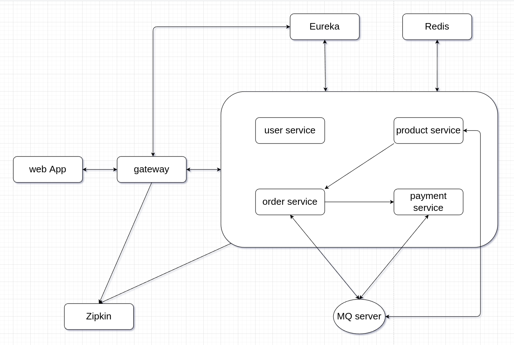
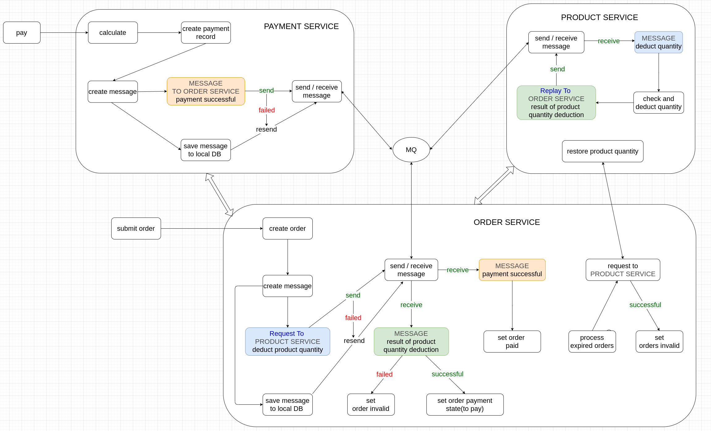
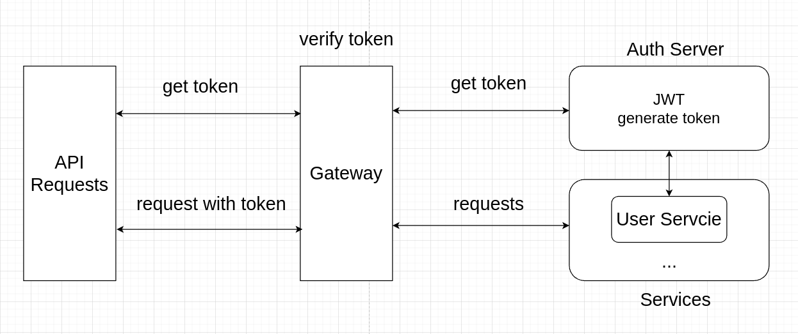
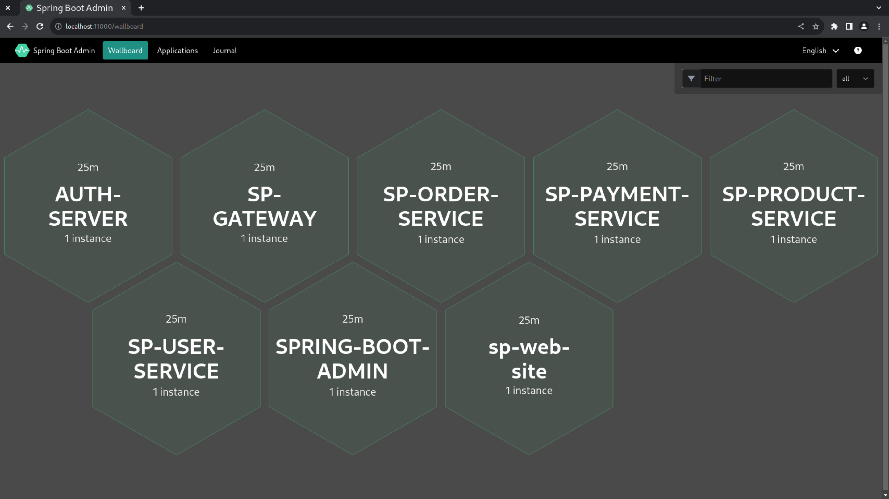

# Online Shop - Microservices Example - Build Microservices Using Spring Boot And Spring Cloud

- Eureka
- Spring Cloud Gateway
- Spring Cloud OpenFeign
- Spring Cloud Circuit Breaker - Resilience4J
- ~~Spring Cloud Sleuth + Zipkin~~  
- Micrometer Tracing + Zipkin  
- Redis
- RedissonLock  
- RabbitMQ
- RabbitMQ RPC - Request / Reply Pattern
- JWT
- Spring Boot 3
- Spring Boot Admin

## Overview

  

### Order Process



### API Token Authentication



## Run And Test

### Requirements

- JDK 20
- Gradle 8
- PostgreSQL
- RabbitMQ
- Redis
- Zipkin
- Podman(>=3.4) & podman-compose (or Docker & `docker cmopose`)

### Preparation

Start servers: PostgreSQL, RabbitMQ, Redis, Zipkin

```shell
cd scripts
podman-compose up -d
```

Or use `docker compose`(Compose V2) / `docker-compose`(Compose V1)

```shell
cd scripts
sudo docker compose up -d
```

### Run

Start : `eurekaServer`, `gateway`, `authServer`, `sbAdmin`;  services: `spProduct, spUser, spOrder, spPayment` and Web App: `spWeb`

```shell
cd scripts
sh run-jars.sh
```

### Test

Add test data before run test

```shell
cd spTest
gradle clean test -i --tests AddTestData
```
*check codes  in `spTest/src/test/java/xyz/defe/sp/test/AddTestData.java`*    

Run test classes

```shell
cd spTest
gradle clean test --tests TestAllSuit
```
*see test classes in `spTest/src/test/java/xyz/defe/sp/test/*`*

### Web UI

Eureka > http://localhost:8761  

Zipkin > http://localhost:9411  

RabbitMQ > http://localhost:15672  

Spring Boot Admin > http://localhost:11000/wallboard  


