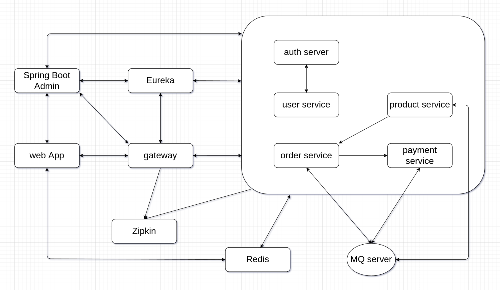

# Online Shop - Microservices Example - Build Microservices Using Spring Boot And Spring Cloud


- Eureka
- Spring Cloud Gateway
- Spring Cloud OpenFeign
- Spring Cloud Circuit Breaker - Resilience4J
- Spring Cloud Sleuth + Zipkin  
- Redis
- RedissionLock  
- RabbitMQ
- RabbitMQ RPC - Request / Reply Pattern
- JWT

## Overview
  

### Order Process


### API Token Authentication


## Run And Test  
### Requirements
- JDK 19
- Gradle
- Database
- RabbitMQ
- Redis
- Zipkin

### Preparation
1. Start servers: database, RabbitMQ, Redis, Zipkin

2. Create databases, names: sp-product, sp-user, sp-order, sp-payment

3. Configure connection settings for projects,
set databases / RabbitMQ / Redis connection info

4. Build `spCommon`, it will generate `spCommon-0.0.1-SNAPSHOT.jar` in `spCommon/build/libs` directory and as a dependency for projects
```shell
cd spCommon
gradle build
```

### Run
1. Start Eureka server: `eurekaServer`

2. Start services: `authServer, spProduct, spUser, spOrder, spPayment`  

3. Start gateway: `gateway`

4. Start web App: `spWeb`

5. Add test data by execute
`addData()` in `spTest/src/test/java/xyz/defe/sp/test/AddTestData.java`

### Web UI
Eureka > http://localhost:8761  
Zipkin > http://localhost:9411

### Test
See test codes in `spTest/src/test/java/xyz/defe/sp/test/*`
